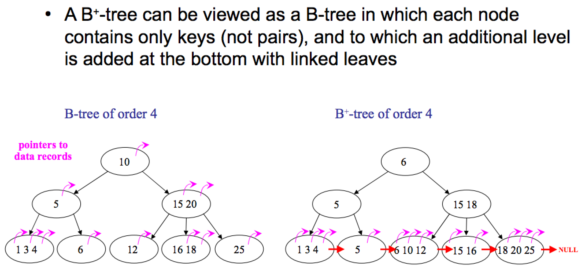

# Leetcode-C++
## STL数据结构
### 1. 优先队列(priority_queue)
* 容器适配器：对外接口只是从队头取元素，从队尾添加元素，再无其他取元素的方式。
* 其中的元素按照某种优先级顺序排列，每次访问或删除的元素都是优先级最高的元素。
#### 1.1 基本特性
1. 默认行为：`std::priority_queue` 是一个**最大堆**，即优先级最高的元素是最大的元素。
2. 底层容器：`std::priority_queue` 默认使用 **std::vector**作为底层容器，但也可以指定其他容器（如 `std::deque`）。
3. 核心操作：
    * `push()`：插入元素--O(logn)
    * `pop()`：删除优先级最高的元素--O(logn)
    * `top()`：访问优先级最高的元素--O(1)
    * `empty()`：检查队列是否为空--O(1)
    * `size()`：返回队列中元素的数量--O(1)
#### 1.2 定义与初始化
1. 默认最大堆：
```C
#include<queue>
using namespace std;
priority_queue<int>maxHeap;
priority_queue<int, vector<int>, greater<int>> minHeap; // 通过传递自定义比较函数（如 std::greater）实现最小堆
```
2. 自定义优先级规则：
* 注意：left>right建立小顶堆（快排：快排的cmp函数的时候，return left>right 就是从大到小，return left<right 就是从小到大）
```C
#include <queue>
#include <functional>
using namespace std;
auto cmp = [](int a, int b) { return a > b; }; // 自定义比较函数
priority_queue<int, vector<int>, decltype(cmp)> customHeap(cmp);
```
#### 1.3 应用场景
1. Top K问题：使用优先队列可以高效地找到数组中最大或最小的 K 个元素。
    * 时间复杂度：O(n*logk)；空间复杂度：O(n)
    ```C
    class Solution_7 {
    public:
    class myCompare{
    public:
        bool operator()(const pair<int,int>&lhs,const pair<int,int>&rhs){
            return lhs.second>rhs.second;   // 满足时返回值1：lhs排在rhs之后
        }
    };
    vector<int> topKFrequent(vector<int>& nums, int k) {
        // 1. 统计元素出现的频率：遍历数组nums，使用map记录
        unordered_map<int,int>map;  // key为元素值；value为出现次数
        int n=nums.size();
        for(int i=0;i<n;i++){
            map[nums[i]]++;
        }
        // 2. 建立一个大小为k的小顶堆：每次插入一个新的值，弹出最小的元素（若使用大顶堆，则需要把所有元素都进行排序，而小顶堆只排序k个元素），这是由于：优先队列只能弹出队首（即堆顶）元素
        priority_queue<pair<int,int>,vector<pair<int,int>>,myCompare>queue;
        for(unordered_map<int, int>::iterator it=map.begin();it!=map.end();it++){   // 采用迭代器遍历map
            queue.push(*it);
            if(queue.size()>k) queue.pop();     // 弹出队首（即堆顶的最小元素）
        }
        // 3. 找出前k个高频元素：倒序输出
        vector<int>res(k);
        for(int i=k-1;i>=0;i--){
            res[i]=queue.top().first;
            queue.pop();
        }
        return res;
    }
    };
    ```
2. 任务调度：按照优先级调度任务

3. Dijkstra算法：在图的单源最短路径算法中，优先队列用于选择当前距离最短的节点

4. 合并K个有序链表

### 2. 映射(map,multimap,unordered_map)
* 遍历map(采用迭代器)：
    ```C
    for(unordered_map<int, int>::iterator it=map.begin();it!=map.end();it++){   // 采用迭代器遍历map
        // *it获取map中的键值对
        }
    ```

## 排序
### 1. 快速排序(QuickSort)
#### 1.1 概述
> 参考：https://zh.wikipedia.org/wiki/快速排序
* 基于**分治法**：通过选择一个基准元素(pivot)，将数组分为两部分：一部分小于基准元素，另一部分大于基准元素，然后递归地对这两部分进行排序。
1. 挑选基准值：从数列中挑出一个元素，称为“基准”（pivot），
2. 分割：重新排序数列，所有比基准值小的元素摆放在基准前面，所有比基准值大的元素摆在基准后面（与基准值相等的数可以到任何一边）。在这个分割结束之后，对基准值的排序就已经完成，
3. 递归排序子序列：递归地将小于基准值元素的子序列、大于基准值元素的子序列排序。
> 递归到最底部的判断条件是数列的大小是零或一，此时该数列显然已经有序。
#### 1.2 复杂度
* 平均时间复杂度：O(n*logn)
* 最坏时间复杂度：O(n^2)（当每次选择的基准元素都是最大或最小值时）
* 空间复杂度：O(logn)（递归调用栈的深度）
#### 1.3 实现
##### 1.3.1 递归实现
```C
// 1. 快速排序（递归）
template<typename T>
void quickSort(T A[],int left, int right) {
    int i = left, j = right;
    int tmp;
    int pivot = A[(left + right) / 2];

    while (i <= j) {
        while (A[i] < pivot) i++;
        while (A[j] > pivot) j--;
        if (i <= j) {
            swap(A[i], A[j]);
            i++;
            j--;
        }
    };

    if (left < j) quickSort(A,left, j);
    if (i < right) quickSort(A,i, right);
}
```
#### 1.4 优化
##### 1.4.1 随机选择基准元素
朴素快排的缺陷：
1. **基准元素选择不当**：比如快排一个有序序列1234567，首先划分1和右区间234567接着划分2和右区间34567，以此类推，直到划分到n层，在做数组划分的时候会遍历整个数组一遍，此时时间复杂度就是O(N)级别；
```C
//优化一：随机选择基准元素
#include <ctime>
srand(time(0));
int get_random(int left, int right){
    return a[rand() % (right - left + 1) + left];   // 在 [left，right]区间内，随机选择一个数
}
```
##### 1.4.2 
2. **有大量重复元素时，递归层数也会增加**：比如数组里面全都是6，不管选择哪一个位置的6为基准元素，选择完后都会划分大于等于6的区间出来，之后再选择再划分，一直划分到数组元素个数的层数就和上面的情况一样了。
    * 例：荷兰国旗问题(Leetcode.T75)

### 2. 堆排序
#### 2.1 概述
* 堆是一个近似完全二叉树的结构，并同时满足堆的性质：即子节点的键值或索引总是小于（或者大于）它的父节点。
* 满足最大堆性质的二叉树：对于除了根之外的每个节点i, `A[parent(i)] ≥ A[i]`

#### 2.2 堆节点的访问
* 通过一维数组实现，在数组起始位置为0的情形中：
    * 父节点i的左子节点：`2*i+1`
    * 父节点i的右子节点：`2*i+2`
    * 子节点i的父节点：`floor((i-1)/2)`

#### 2.3 堆的操作
##### 2.3.1 最大堆调整（Max Heapify）：a[i]左右子树都是最大堆,调整以a[i]为根结点的二叉树为最大堆
* 时间复杂度:T(n)<=T(2n/3)+theta(1),T(n)=O(lgn).
###### 递归写法
```cpp
void maxHeapify(vector<int>&a, int i, int heapSize){
    int l=i*2+1,r=i*2+2,largest=i;
    if(l<heapSize && a[l]>a[largest]){      // 1. 获取左右子节点中，更大的一个
        largest=l;
    }
    if(r<heapSize && a[r]>a[largest]){
        largest=r;
    }
    if(largest!=i){                         // 2. 交换父节点和子节点，再递归处理
        swap(a[i],a[largest]);
        maxHeapify(a, largest, heapSize);
    }
}
```
###### 迭代写法
```cpp
void _maxHeapify(vector<int>&a, int left, int right){
    int parent=left,child=parent*2+1;
    while(child<=right){
        if(child+1<=right && a[child]<a[child+1]){
            child++;    // 1. 获取左右子节点中，更大的一个
        }
        if(a[parent]>a[child]){
            return;
        }
        else{      // 2. 交换父节点和子节点
            swap(a[parent],a[child]);
            parent=child;       // 递推
            child=parent*2+1;
        }
    }
}
```
##### 2.3.2 建堆:自底向上,用max_heapify将数组转为最大堆:a[len/2+1,...,len]为叶节点,每个叶节点看作一个元素的堆
* 时间复杂度:非紧确界:O(n*lgn);紧确界:O(n).
```cpp
void buildMaxHeap(vector<int>&a,int len){
    int heapSize=len;
    for(int i=heapSize/2-1;i>=0;i--){       // 从最后一个父节点开始调整
        maxHeapify(a, i, heapSize);
        // _maxHeapify(a,i,heapSize-1);
    }
}
```
##### 2.3.3 堆排序(升序)
1. 建立初始最大堆a[0,...,heapSize-1]
2. 把堆首（最大值）和堆尾互换
3. 把堆的尺寸缩小1，并调用maxHeapify,目的是把新的堆顶元素下沉至相应位置
4. 重复步骤2，直到堆的尺寸为1
```cpp
void heapSort(vector<int> &a,int len){
    buildMaxHeap(a,len);   //建立初始最大堆
    int heapSize=len;
    for(int i=heapSize-1;i>0;i--)
    {
        swap(a[0],a[i]);
        heapSize-=1;
        maxHeapify(a,0,heapSize);
    }
}
```
##### 2.3.4 去除堆顶最大元素: 将最后一个元素移至堆顶，再下沉
* 时间复杂度:O(logn)
```cpp
int heapExtractMax(vector<int>&a,int &heapsize){
    if(heapsize<1) return -1;       //无效
    int max=a[0];
    a[0]=a[heapsize-1];
    heapsize--;
    maxHeapify(a,0,heapsize);
    return max;
}
```
##### 2.3.5 最大堆元素值增加后，调整最大堆
```cpp
void heapIncreaseKey(vector<int>&a, int i, int key){
    if(a[i]>key) return;
    a[i]=key;
    while(i>0 && a[(i-1)/2]<a[i]){  //上浮:与父节点交换
        swap(a[i],a[(i-1)/2]);
        i=(i-1)/2;
    }
}
```
##### 2.3.6 最大堆插入元素
* 时间复杂度:O(logn)
```cpp
#define INFINITY -10000
void maxHeapInsert(vector<int>&a, int key, int &heapSize){
    heapSize++;
    a[heapSize]=INFINITY;
    heapIncreaseKey(a,heapSize,key);
}
```

## 数组
### 1. 理论基础
* 数组：存放在**连续内存空间**伤的相同类型数据的集合；数组下标从0开始。
* 在删除/增添元素时，可能需要移动其他元素的地址。
> vector的的底层实现是array；
> 在C++中，二维数组是连续分布的；Java没有指针，同时也不对程序员暴露其元素的地址，寻址操作完全交给虚拟机，所以不一定是连续的。
### 2. 二分查找
#### 2.1 前提：数组有序
#### 2.2 区间写法
##### 2.2.1 target在[left,right]区间
* **while(left<=right)**：因为left == right是有意义的，所以使用 <=
* if (nums[middle] > target) **right 要赋值为 middle - 1**：因为当前这个nums[middle]一定不是target，那么接下来要查找的左区间结束下标位置就是 middle - 1
```C
// 写法一：[left,right]区间
class Solution_1_1 {
public:
    int search(vector<int>& nums, int target) {
        int left=0,right=nums.size()-1;
        while(left<=right){
            int mid=left+(right-left)/2;
            if(nums[mid]>target){
                right=mid-1;
            }else if(nums[mid]<target){
                left=mid+1;
            }else{
                return mid;
            }
        }
        return -1;
    }
};
```

##### 2.2.2 target在[left,right)区间
* **while(left<right)**：这里使用 < ,因为left == right在区间[left, right)是没有意义的
* if (nums[middle] > target) **right 更新为 middle**，因为当前nums[middle]不等于target，去左区间继续寻找，所以right更新为middle，即：下一个查询区间不会去比较nums[middle]
```C
// 写法二：[left,right)区间
class Solution_1_2 {
public:
    int search(vector<int>& nums, int target) {
        int left=0,right=nums.size();
        while(left<right){
            int mid=left+(right-left)/2;
            if(nums[mid]>target){
                right=mid;
            }else if(nums[mid]<target){
                left=mid+1;
            }else{
                return mid;
            }
        }
        return -1;
    }
};
```

#### 2.3 有重复元素时，查找目标区间
* 分别运用二分查找，查找左边界、右边界
```C
/* 三种情况：
 1. target 在数组范围的右边或者左边，例如数组{3, 4, 5}，target为2或者数组{3, 4, 5},target为6，此时应该返回[-1, -1];
 2. target 在数组范围中，且数组中不存在target，例如数组{3,6,7},target为5，此时应该返回[-1, -1];
 3. target 在数组范围中，且数组中存在target，例如数组{3,6,7},target为6，此时应该返回[-1, -1].
 */
int getLeftBorder(vector<int>&nums,int target){     // 寻找左边界:不包含target的左边界
        int left=0,right=nums.size()-1;
        int leftBorder=-2;
        while(left<=right){
            int mid=left+((right-left)>>1);
            if(nums[mid]>=target){  // 此时nums[mid-1]<=target，设为新的左边界
                right=mid-1;leftBorder=right;
            }else{
                left=mid+1;
            }
        }
        return leftBorder;
    }
```

#### 2.4 找出第K小的数对距离
* 数对 (a,b) 由整数 a 和 b 组成，其数对距离定义为 a 和 b 的绝对差值。给你一个整数数组 nums 和一个整数 k ，数对由 nums[i] 和 nums[j] 组成且满足 0 <= i < j < nums.length 。返回 所有数对距离中 第 k 小的数对距离。
    * 思路：两层二分
        1. 第 k 小的数对距离必然在区间 [0,max(nums)−min(nums)] 内，在此区间进行二分；
        2. 给定距离 mid，计算所有距离小于等于 mid 的数对数目 cnt ,使用二分查找：枚举所有数对的右端点 j，二分查找大于等于 nums[j]−mid 的最小值的下标 i，那么右端点为 j 且距离小于等于 mid 的数对数目为 j−i，计算这些数目之和。
        * 外层二分查找：O(logD);内层二分查找:O(n*logn). 总时间复杂度：O(nlogn*logD)
        * 空间复杂度：O(logn)，排序的平均空间复杂度
```cpp
class Solution_13 {
public:
    int smallestDistancePair(vector<int>& nums, int k) {
        sort(nums.begin(),nums.end());
        int n=nums.size(),left=0,right=nums[n-1]-nums[0];
        
        while(left<=right){     // 1. 先对距离区间[left,right]进行二分
            int mid=(left+right)/2,cnt=0;
            // 计算所有距离小于等于mid的数组
            for(int j=0;j<n;j++){   // 2. 再对排序后的数组二分，查找和nums[j]的距离不超过mid的下标范围
                int i=lower_bound(nums.begin(), nums.begin()+j, nums[j]-mid)-nums.begin();
                cnt+=j-i;
            }
            if(cnt>=k){
                right=mid-1;
            }else{
                left=mid+1;
            }
        }
        return left;        // 对于left，有：cnt<k才会更新
    }
};
```
* 找算数平方根/判断是否为完全平方数
* 有序矩阵中第 K 小的元素：
    1. 法一：直接排序:将这个二维数组转成一维数组，并对该一维数组进行排序
    2. 归并排序:n 个数组归并，用小根堆维护
        ```cpp
        // 小根堆定义
        struct point{
            int val,x,y;
            point(int _val,int _x,int _y):val(_val),x(_x),y(_y){}
            bool operator > (const point &a)const{return this->val>a.val;} // 定义>
        };
        priority_queue<point, vector<point>, greater<point>>queue;  // 小根堆：要定义>符号
        ```
    3. 二分查找：
        * 整个二维数组中 matrix[0][0] 为最小值，matrix[n−1][n−1] 为最大值，现在我们将其分别记作 l 和 r.
        1. 初始位置在 matrix[n−1][0]（即左下角）；
        2. 设当前位置为 matrix[i][j]。若 matrix[i][j]≤mid，则将当前所在列的不大于 mid 的数的数量（即 i+1）累加到答案中，并向右移动，否则向上移动；
        3. 不断移动直到走出格子为止。
        ```cpp
        class Solution_5_3 {
        public:
        bool check(vector<vector<int>>& matrix, int mid, int k, int n){
        int i=n-1,j=0;
        int cnt=0;      // 统计整个矩阵中，<=mid的元素个数
        while(i>=0 && j<n){
            if(matrix[i][j]<=mid){
                cnt+=i+1;   // 当前列中,<=mid的元素个数
                j++;
            }else{
                i--;
            }
        }
            return cnt>=k;
        }
        int kthSmallest(vector<vector<int>>& matrix, int k) {
            int n=matrix.size();
            int left=matrix[0][0],right=matrix[n-1][n-1];
            while(left<right){      // 采用了二分查找的写法二
            int mid=left+((right-left)>>1);
            if(check(matrix,mid,k,n)){
                right=mid;
            }else{
                left=mid+1;
            }
        }
        return left;
        }
        };
        ```
    * 总结：第一种没有利用矩阵的性质，所以时间复杂度最差；第二种解法只利用了一部分性质（每一行是一个有序数列，而忽视了列之间的关系）；第三种解法则利用了全部性质，所以时间复杂度最佳。

### 3. 滑动窗口
#### 3.1 滑动窗口模版
```C
for (int l = 0, r = 0 ; r < n ; r++) {  //外层循环扩展右边界
	//当前考虑的元素
	while (l <= r && check()) {//区间[left,right]不符合题意
        //内层循环收缩左边界
    }
    //区间[left,right]符合题意，统计相关信息
}
```
* 长度最小的子数组：滑动窗口为：满足其和>=s的长度最小的连续子数组
* 水果成篮：
* 最小覆盖子串：给你一个字符串 s 、一个字符串 t 。返回 s 中涵盖 t 所有字符的最小子串。如果 s 中不存在涵盖 t 所有字符的子串，则返回空字符串 "" 。
    * 采用哈希表记录：当前窗口内，某个字符出现次数
    * 时间复杂度：O(|s|+|t|)；空间复杂度：O(C),C为字符集的大小
    * ```C
        // 采用哈希表记录：当前窗口内，某个字符出现次数
        // 时间复杂度：O(|s|+|t|)；空间复杂度：O(C),C为字符集的大小
        class Solution_3 {
        public:
            bool check(){       // s_char_map是否包括所有t_char_map中字符
                for(const auto &pair:t_char_map){
                    if(s_char_map[pair.first]<pair.second) return false;
                }
                return true;
            }
            unordered_map<char,int>t_char_map,s_char_map;
            string minWindow(string s, string t) {
                int len=INT_MAX,ansL=-1;
                // 1. 统计字符串t中每个字符的出现次数
                for(int i=0;i<t.size();i++){
                    t_char_map[t[i]]++;
                }
                // 2. 滑动窗口
                for(int l=0,r=0;r<s.size();r++){    // 外层循环扩展右边界
                    // 2.1 判断当前字符是否在t中出现：若出现，进行统计
                    if(t_char_map.find(s[r])!=t_char_map.end()){
                        s_char_map[s[r]]++;
                    }
                    while(l<=r && check()){
                        if(r-l+1<len){
                            len=r-l+1;
                            ansL=l;
                        }
                        // 2.2 内层循环收缩左边界
                        if(s_char_map.find(s[l])!=s_char_map.end()){
                            s_char_map[s[l]]--;
                        }
                        l++;
                    }
                }
                return ansL==-1?string():s.substr(ansL,len);
            }
        };
        ```
* 串联所有单词的子串

* 滑动窗口最大值
    > 给你一个整数数组 nums，有一个大小为 k 的滑动窗口从数组的最左侧移动到数组的最右侧。你只可以看到在滑动窗口内的 k 个数字。滑动窗口每次只向右移动一位。返回 滑动窗口中的最大值 。
    * 滑动窗口每向右移动一位，则最左侧的元素移除，如何维护最大值？
        1. 采用大根堆实时维护一系列元素中的最大值（优先队列实现），为了保证堆顶的元素在滑动窗口中：不断地移除堆顶的元素，直到其确实出现在滑动窗口中
        2. 设置单调队列（严格递减）：
            * 最大值：队首元素
            * 移除最左侧元素：与队首元素相等时移除（即为最大值），否则不影响；
            * 加入最右侧元素：从队尾往前，淘汰队中所有小于当前元素的元素
        ```C
        class Solution_6_2 {
        private:
        class MyQueue{      // 单调队列：从大到小
            public:
            deque<int>que;
            void pop(int x){        // 比较当前要弹出的数值是否等于队列出口元素的数值，如果相等则弹出
                // 当且仅当：队列中最大值，是需要从滑动窗口中移除的值时，才弹出
                if(!que.empty()&&que.front()==x){
                    que.pop_front();
                }
            }
            void push(int x){   // 如果push的数值大于入口元素的数值，那么就将队列后端的数值弹出，直到push的数值小于等于队列入口元素的数值为止
                while(!que.empty()&&x>que.back()){
                    que.pop_back();
                }
                que.push_back(x);
            }
            int front(){        // 查询队列的最大值：直接返回队首的元素
                return que.front();
            }
        };
        public:
        vector<int> maxSlidingWindow(vector<int>& nums, int k) {
            MyQueue queue;  // queue为单调队列，其中的值从大到小存放
            for(int i=0;i<k;i++) queue.push(nums[i]);
        
            vector<int>ans;
            int n=nums.size();
            ans.push_back(queue.front());
            for(int i=k;i<n;i++){
                queue.pop(nums[i-k]);
                queue.push(nums[i]);
                ans.push_back(queue.front());
            }
            return ans;
        }
        };
        ```

### 4. 前缀和数组
* sums[i] 表示：从 nums[0] 到 nums[i−1] 的元素和
```C
int n=nums.size();
vector<int> sums(n+1,0);
for(int i=1;i<=n;i++){
    sums[i]=sums[i - 1] + nums[i - 1];
}
```

### 5. 分糖果
> n 个孩子站成一排。给你一个整数数组 ratings 表示每个孩子的评分。
> 你需要按照以下要求，给这些孩子分发糖果：
> 1. 每个孩子至少分配到 1 个糖果。
> 2. 相邻两个孩子评分更高的孩子会获得更多的糖果。
> 3. 请你给每个孩子分发糖果，计算并返回需要准备的 最少糖果数目 .
* 法一：从左到右贪心一遍；从右到左贪心一遍：
    * 分别将当前元素，与左右两个相邻元素比较，求出满足规则时的最小值；每个人最终分得的糖果数量即为这两个数量的最大值。
```C
// 时间复杂度：O(n)；空间复杂度：O(n)
class Solution_11_1 {
public:
    int candy(vector<int>& ratings) {
        int n=ratings.size();
        vector<int>left(n);
        for(int i=0;i<n;i++){
            if(i>0&&ratings[i]>ratings[i-1]){
                left[i]=left[i-1]+1;    // 比左边的元素，多分一个糖果
            }else{
                left[i]=1;
            }
        }
        int right=0,ans=0;
        for(int i=n-1;i>=0;i--){
            if(i<n-1 && ratings[i]>ratings[i+1]){
                right++;    // 比右边的元素，多分一个糖果
            }else{
                right=1;
            }
            ans+=max(left[i],right);
        }
        return ans;
    }
};
```
```C
// 法二：常数空间遍历：要么在递增序列，要么在递减序列
// 1. 处于递增序列：比上一个元素糖果数+1；
// 2. 处于递减序列：分配给当前同学一个糖果，并把该同学所在的递减序列中所有的同学都再多分配一个糖果
class Solution_11_2 {
public:
    int candy(vector<int>& ratings) {
        int n=ratings.size();
        int inc=1,dec=0,pre=1;  // inc,dec分别为递增、递减序列的长度
        int ret=1;
        
        for(int i=1;i<n;i++){
            if(ratings[i]>=ratings[i-1]){   // 递增序列中
                dec=0;
                pre = ratings[i] == ratings[i- 1] ? 1 : pre+1;  //当前同学和上一个同学分数相等时，直接分配1个就行，这样满足最小
                ret+=pre;
                inc=pre;
            }else{
                dec++;
                if(dec==inc) dec++; // 当递减序列长度和递增序列长度相等时，把递增序列的最后一个同学分配到递减序列中
                ret+=dec;
                pre=1;
            }
        }
        return ret;
    }
};
```
### 6. 接雨水

* 法一：动态规划:数组leftMax, rightMax分别记录：leftMax[i] 表示下标 i 及其左边的位置中，height 的最大高度；rightMax[i] 表示下标 i 及其右边的位置中，height 的最大高度。
    * 初始状态：leftMax[0]=height[0]，rightMax[n−1]=height[n−1]
    * 转移方程：
        1. 当 1≤i≤n−1 时，leftMax[i]=max(leftMax[i−1],height[i])；
        2. 当 0≤i≤n−2 时，rightMax[i]=max(rightMax[i+1],height[i])
    * 位置i处接的雨水量：min(leftMax[i],rightMax[i])−height[i].
```C
// 时间复杂度：O(n)；空间复杂度：O(n)
class Solution12_1 {
public:
    int trap(vector<int>& height) {
        int n=height.size();
        if(n==0) return 0;
        
        vector<int>leftMax(n,0);
        leftMax[0]=height[0];
        for(int i=1;i<n;i++){
            leftMax[i]=max(leftMax[i-1],height[i]);
        }
        
        vector<int>rightMax(n,0);
        rightMax[n-1]=height[n-1];
        for(int i=n-2;i>=0;i--){
            rightMax[i]=max(rightMax[i+1],height[i]);
        }
        int ret=0;
        for(int i=0;i<n;i++){
            ret+=min(leftMax[i],rightMax[i])-height[i];
        }
        return ret;
    }
};
```
### 7. 区间问题
* 合并/插入区间：按照区间左端点升序排序
* 引爆气球：按照区间右端点升序排序（寻找当前可引爆的所有区间中，右边界的最小值）

## 链表
### 1. 理论基础
* 链表：通过指针串联的线性结构，每一个节点由两个部分组成：**数据域**、**指针域**
#### 1.1 链表类型
##### 1.1.1 单链表
* 指针域只能指向节点的下一个节点
##### 1.1.2 双链表
* 每一个节点有两个指针域，一个指向下一个节点，一个指向上一个节点。
* 既可以向前查询也可以向后查询
##### 1.1.3 循环链表
* 链表首尾相连（可解决约塞夫环问题）


#### 1.2 链表存储方式
* 数组在内存中连续分布 & **链表在内存中不是连续分布的，通过指针域的指针链接在内存中各个节点（分配机制取决于操作系统的内存管理）**

#### 1.3 链表定义
单链表：
> 如果不定义构造函数，初始化时使用默认构造函数
```C
struct ListNode{
    int val;
    ListNode *next;
    ListNode(int x):val(x),next(NULL){} // 构造函数
}
```

#### 1.4 链表的操作
##### 1.4.1 删除节点
1. 将C节点的next指针指向E节点；
2. C++中手动释放D节点（Java,python有内存回收机制）

> ```C
> delete tmp;
> tmp=nullptr;
>    //被delete后的指针tmp的值（地址）并非就是NULL，而是随机值。也就是被delete后，
>    //如果不再加上一句tmp=nullptr,tmp会成为乱指的野指针
> ```

* 直接使用原来的链表进行删除操作：分删除头节点、非头节点两种情况
* 设置一个**虚拟头节点**进行删除操作
    * 例：移除指定值的链表元素
    ```C
    class Solution_1_2 {
    public:
    ListNode* removeElements(ListNode* head, int val) {
        ListNode *dummy=new ListNode(0);
        dummy->next=head;
        ListNode *cur=dummy;
        while(cur!=nullptr && cur->next!=nullptr){
            if(cur->next->val==val){
                ListNode *tmp=cur->next;
                cur->next=cur->next->next;
                delete tmp;
            }else{
                cur=cur->next;
            }
        }
        head=dummy->next;
        delete dummy;
        return head;
    }
    };
    ```

##### 1.4.2 添加节点


#### 1.5 性能分析


#### 1.6 经典题目
##### 1.6.1 反转链表II
> 给你单链表的头指针 head 和两个整数 left 和 right ，其中 left <= right 。请你反转从位置 left 到位置 right 的链表节点，返回 反转后的链表 。
* 思路：断开反转区域两侧；反转链表；重新接上
* 时间复杂度：O(N)，最坏情况遍历整个链表；空间复杂度：O(1)
```C
class Solution_5 {
public:
    void reverseLinkedList(ListNode *head){
        ListNode *cur=head,*pre=nullptr;
        while(cur!=nullptr){
            ListNode *tmp=cur->next;    // 记录原本的下一个节点（否则反转指针走向后，找不到）
            cur->next=pre;
            pre=cur;cur=tmp;
        }
    }
    ListNode* reverseBetween(ListNode* head, int left, int right) {
        ListNode *dummy=new ListNode(0);
        dummy->next=head;
        
        ListNode *pre=dummy;
        for(int i=0;i<left-1;i++){  // pre来到left-1位置的节点
            pre=pre->next;
        }
        ListNode *rightNode=pre;
        for(int i=0;i<right-left+1;i++){    // rightNode来到right位置的节点
            rightNode=rightNode->next;
        }
        ListNode *leftNode=pre->next,*succ=rightNode->next;
        
        // 反转前切断连接
        pre->next=nullptr;rightNode->next=nullptr;
        // 反转[left,right]区间的链表
        reverseLinkedList(leftNode);
        
        // 重新接回原来的链表
        pre->next=rightNode;
        leftNode->next=succ;
        
        return dummy->next;
    }
};
```
###### 优化
* 法一缺点：如果 left 和 right 的区域很大，恰好是链表的头节点和尾节点时，找到 left 和 right 需要遍历一次；反转它们之间的链表还需要遍历一次
* 优化思路：在需要反转的区间里，每遍历到一个节点，让这个新节点来到反转部分的起始位置。


##### 1.6.2 环形链表
* 法一：运用哈希表登记
    * 时间复杂度：O(n)；空间复杂度：O(n)，将每个节点插入哈希表一次
    ```C
    class Solution_8_1 {
    public:
    bool hasCycle(ListNode *head) {
        unordered_set<ListNode *>seen;
        while(head!=nullptr){
            if(seen.count(head)) return true;
            seen.insert(head);
            head=head->next;
        }
        return false;
    }
    };
    ```
* 法二：Floyd 判圈算法：
    > 定义两个指针，一快一慢。慢指针每次只移动一步，而快指针每次移动两步。
    > 初始时，慢指针在位置 head，而快指针在位置 head.next。
    > 这样一来，如果在移动的过程中，快指针反过来追上慢指针，就说明该链表为环形链表；否则快指针将到达链表尾部，该链表不为环形链表。
    * 时间复杂度：
        1. 当链表中不存在环时，快指针将先于慢指针到达链表尾部，链表中每个节点至多被访问两次；
        2. 当链表中存在环时，每一轮移动后，快慢指针的距离将减小一。而初始距离为环的长度，因此至多移动 N 轮。
    * 空间复杂度：O(1)
    ```C
    class Solution_8_2 {
    public:
    bool hasCycle(ListNode *head) {
        if(head==nullptr||head->next==nullptr) return false;
        ListNode *slow=head,*fast=head->next;
        while(slow!=fast){
            if(fast==nullptr||fast->next==nullptr) return false;
            slow=slow->next;
            fast=fast->next->next;
        }
        return true;
    }
    };
    ```
###### 环形链表II:找到环形入口
> 给定一个链表的头节点  head ，返回链表开始入环的第一个节点。 如果链表无环，则返回 null。
> 如果链表中有某个节点，可以通过连续跟踪 next 指针再次到达，则链表中存在环。 为了表示给定链表中的环，评测系统内部使用整数 pos 来表示链表尾连接到链表中的位置（索引从 0 开始）。如果 pos 是 -1，则在该链表中没有环。注意：pos 不作为参数进行传递，仅仅是为了标识链表的实际情况。
> 不允许修改 链表。
* 假设从头结点到环形入口节点的节点数为x; 环形入口节点到fast指针与slow指针相遇节点数为y; 从相遇节点再到环形入口节点数为z.
    * 有：x+n(y+z)+y=2(x+y)，即：x=n(y+z)-y=(n-1)(y+z)+z.
    * 从头节点/相遇节点出发，到环形入口节点的距离相同。
* 时间复杂度:O(n);快慢指针相遇前，指针走的次数小于链表长度，快慢指针相遇后，两个index指针走的次数也小于链表长度，总体为走的次数小于 2n.
* 空间复杂度: O(1).
```C
class Solution_9{
public:
    ListNode *detectCycle(ListNode *head) {
        ListNode *slow=head,*fast=head;
        while(fast!=nullptr&&fast->next!=nullptr){
            slow=slow->next;
            fast=fast->next->next;
            
            if(slow==fast){     // 快慢指针相遇
                ListNode *node1=head,*node2=fast;
                while(node1!=node2){
                    node1=node1->next;
                    node2=node2->next;
                }
                return node1;
            }
        }
        return nullptr;
    }
};
```
## 哈希表
### 1. 理论基础
* 场景：**要快速判断一个元素是否出现集合里的时候**
* 本质：牺牲了空间、换取了时间：因为我们要使用额外的数组，set或者是map来存放数据，才能实现快速的查找
* 使用：要使用集合来解决哈希问题的时候：
    1. 优先使用`unordered_set`，查询和增删效率最优（均为O(1)）；
    2. 如果需要集合有序，则使用`set`；
    3. 如果要求不仅有序还要有重复数据的话，则使用`multiset`.

| 集合               | 底层实现 | 是否有序 | 数值是否可以重复 | 能否更改数值 | 查询效率 | 增删效率 |
|--------------------|----------|----------|------------------|--------------|----------|----------|
| std::set           | 红黑树   | 有序     | 否               | 否           | O(log n) | O(log n) |
| std::multiset      | 红黑树   | 有序     | 是               | 否           | O(log n) | O(log n) |
| std::unordered_set | 哈希表   | 无序     | 否               | 否           | O(1)     | O(1)     |

* std::unordered_map 底层实现为哈希表，std::map 和std::multimap 的底层实现是红黑树。同理，std::map 和std::multimap 的key也是有序的。

| 映射                | 底层实现 | 是否有序   | 数值是否可以重复 | 能否更改数值 | 查询效率 | 增删效率 |
|---------------------|----------|------------|------------------|--------------|----------|----------|
| std::map           | 红黑树   | key 有序   | key 不可重复     | key 不可修改 | O(log n) | O(log n) |
| std::multimap      | 红黑树   | key 有序   | key 可重复       | key 不可修改 | O(log n) | O(log n) |
| std::unordered_map | 哈希表   | key 无序   | key 不可重复     | key 不可修改 | O(1)     | O(1)     |

#### 1.1 常见的三种哈希结构
1. 数组（数组大小已知时使用，如字母异位词；不适用于哈希值少、特别分散、跨度很大的题目）
2. set（集合）
> 直接使用set，占用空间比数组大，而且速度要比数组慢，set将数值映射到key上的步骤需要做hash计算。
> 因此优先用数组。
* 例：两数组的交集
    ```C
    // 2. 两个数组的交集:给定两个数组 nums1 和 nums2 ，返回 它们的 交集 。输出结果中的每个元素一定是 唯一 的。我们可以 不考虑输出结果的顺序 。
    // 思路：使用unordered_set，分别记录：nums1,nums2中出现过的字母
    // 时间复杂度：O(n+m)，m是因为要将set转为vector
    // 空间复杂度：O(n)
    class Solution_2 {
    public:
    vector<int> intersection(vector<int>& nums1, vector<int>& nums2) {
        unordered_set<int>result_set;
        unordered_set<int>nums_set(nums1.begin(),nums1.end());  // 将nums1中的所有元素，放入nums_set（使用迭代器）
        for(int num:nums2){
            if(nums_set.find(num)!=nums_set.end()){     // nums_set中找到了num
                result_set.insert(num);
            }
        }
        return vector<int>(result_set.begin(),result_set.end());
    }
    };
    ```
3. map（映射）
    * 例：字母异位词分组
    ```C
    // 2. T49.字母异位词分组:给你一个字符串数组，请你将 字母异位词 组合在一起。可以按任意顺序返回结果列表。
    // 思路：对每个字符串中的字母出现次数计数，哈希表的键为升序排列的字符串；值为原字符串数组
    class Solution_2 {
    public:
    vector<vector<string>> groupAnagrams(vector<string>& strs) {
        unordered_map<string,vector<string>>map;
        
        for(string str:strs){
            int counts[26]={0};
            for(char ch:str){
                counts[ch-'a']++;
            }
            string key="";  // 将字符升序排列，例：a2b1c3
            for(int i=0;i<26;i++){
                key.push_back('a'+i);key.push_back(counts[i]);
            }
            map[key].push_back(str);
        }
        vector<vector<string>>res;
        for(auto &pair:map){
            res.push_back(pair.second);
        }
        return res;
    }
    };
    ```
#### 1.2 hash表冲突解决方案
##### 1.2.1 开放寻址法
* 从发生冲突的那个单元起，按照一定的次序，从哈希表中找到一个下一个空闲的单元。然后把发生冲突的元素存入到该单元的一种方法。
* 优点：
    * 缓存友好：由于所有数据都存储在同一个**数组**中，开放寻址法通常具有更好的缓存局部性，访问速度较快。
    * 内存效率高：不需要额外的指针存储，内存使用更紧凑。
* 缺点：
    * 冲突处理复杂：当哈希冲突较多时，查找、插入和删除操作的时间复杂度可能退化为 O(n)。
    * 负载因子敏感：负载因子（表中元素数量与表大小的比值）较高时，性能会显著下降。
* 适用场景：适合**负载因子较低、数据量较小**且对**缓存性能要求较高**的场景。

###### 方法种类
1. 线性探查法：从发生冲突的单元起，依次判断下一个单元是否为空，当达到最后一个单元时，再从表首依次判断。
2. 平方探查法：发生冲突时，用发生冲突的单元 d[i], 加上 1²、 2² 等。即 d[i] + 1²，d[i] + 2², d[i] + 3²… 直到找到空闲单元。
    * 在实际操作中，平方探查法不能探查到全部剩余的单元。不过在实际应用中，能探查到一半单元也就可以了。若探查到一半单元仍找不到一个空闲单元，表明此散列表太满，应该重新建立。
3. 双散列函数探查法：使用两个散列函数 h1 和 h2。
    * 其中 h1 关键字为自变量，产生一个 0 至 m-1 之间的数作为**散列地址**；
    * h2 也以关键字为自变量，产生一个 1 至 m-1 之间的并和 m 互素的数（即 m 不能被该数整除）作为探查序列的地址增量（即**步长**）。这样做是使探查序列能够分布在整个 Hash 表。
4. 伪随机探查法：建立一个伪随机数发生器来生成探查序列。
> 例如，假设哈希表长度 m=11，哈希函数为：H(key)= key % 11，则 H(47)=3，H(26)=4，H(60)=5，假设下一个关键字为 69，则H(69)=3，与 47 冲突。
> 如果用伪随机探测再散列处理冲突，且伪随机数序列为：2，5，9，…，则下一个哈希地址为 H1=(3+2)%11=5，仍然冲突，再找下一个哈希地址为 H2=(3+5)%11=8，此时不再冲突，将 69 填入 8 号单元。

##### 1.2.2 链地址法
* 将哈希值相同的元素构成一个同义词的单向链表，并将单向链表的头指针存放在哈希表的第 i 个单元中。
* 优点：
    * 冲突处理简单：每个桶使用链表（或其他数据结构）存储冲突元素，冲突时只需在链表中操作，性能更稳定。
    * 负载因子容忍度高：即使负载因子较高，性能也不会显著下降。
* 缺点：
    * 缓存不友好：链表节点分散在内存中，缓存局部性较差，访问速度可能较慢。
    * 内存开销大：需要额外的指针存储链表节点。
* 适用场景：适合负载因子较高、数据量较大且对冲突处理要求较高的场景。

##### 1.2.3 再哈希法
* 同时构造多个不同的哈希函数，当H1 = RH1(key) 发生冲突时，再用H2 = RH2(key) 进行计算，直到冲突不再产生。

##### 1.2.4 建立公共溢出区
* 将哈希表分为公共表和溢出表，当溢出发生时，将所有溢出数据统一放到溢出区。

###### 开放寻址法和拉链法从性能上说哪个比较快？
在访问次数差不多的情况下，开放寻址法更快，因为计算机访问内存的时候是读到cache中的数组中查找，在内存中查的话按照地址顺序查找，相近的地址都会被访问到（程序的局部性原理）。但是链表的地址不是按顺序的。像哈希表，就是使用开放寻址法实现的。

### 2 经典题目
#### 2.1 两数之和
> 给定一个整数数组 nums 和一个整数目标值 target，请你在该数组中找出 和为目标值 target  的那 两个 整数，并返回它们的数组下标。
```C
class Solution_5 {
public:
    vector<int> twoSum(vector<int>& nums, int target) {
        unordered_map<int,int>map;  // key为数值；value为下标
        for(int i=0;i<nums.size();i++){
            auto iter=map.find(target-nums[i]);
            if(iter!=map.end()){    // 找到了
                return {iter->second,i};
            }
            map.insert(pair<int, int>(nums[i], i));
        }
        return {};
    }
};
```
#### 2.2 三数之和
> 给你一个整数数组 nums ，判断是否存在三元组 [nums[i], nums[j], nums[k]] 满足 i != j、i != k 且 j != k ，同时还满足 nums[i] + nums[j] + nums[k] == 0 。请你返回所有和为 0 且不重复的三元组。
```C
// 使用双指针：首先将数组排序，然后有一层for循环，i从下标0的地方开始，同时定一个下标left 定义在i+1的位置上，定义下标right 在数组结尾的位置上。
// 如果nums[i] + nums[left] + nums[right] > 0 ，left向右移动；
// 如果 nums[i] + nums[left] + nums[right] < 0 ，right向左移动。
// 时间复杂度：O(n^2)；空间复杂度：O(1)
class Solution_6 {
public:
    vector<vector<int>> threeSum(vector<int>& nums) {
        vector<vector<int>> res;
        sort(nums.begin(),nums.end());  // 升序排序
        
        for(int i=0;i<nums.size();i++){
            if(nums[i]>0) return res;
            if(i>0 && nums[i]==nums[i-1]) continue;     // 对a去重
            
            int left=i+1,right=nums.size()-1;
            while(left<right){
                if(nums[i]+nums[left]+nums[right]>0) right--;
                else if(nums[i]+nums[left]+nums[right]<0) left++;
                else{
                    res.push_back(vector<int>{nums[i],nums[left],nums[right]});
                    while(right>left && nums[right]==nums[right-1]) right--;    // 对b,c去重
                    while(right>left && nums[left]==nums[left+1]) left++;
                    right--;left++;
                }
            }
        }
        return res;
    }
};
```
* 拓展：四数之和
> 三数之和的双指针解法是一层for循环num[i]为确定值，然后循环内有left和right下标作为双指针，找到nums[i] + nums[left] + nums[right] == 0。
> 四数之和的双指针解法是两层for循环nums[k] + nums[i]为确定值，依然是循环内有left和right下标作为双指针，找出nums[k] + nums[i] + nums[left] + nums[right] == target的情况，三数之和的时间复杂度是O(n^2)，四数之和的时间复杂度是O(n^3) 。

* std::unordered_set底层实现为哈希表，std::set 和std::multiset 的底层实现是红黑树。红黑树是一种平衡二叉搜索树，所以key值是有序的，但key不可以修改，改动key值会导致整棵树的错乱，所以只能删除和增加。

## 字符串

## 双指针

## 栈与队列
### 1. 理论基础
栈和队列是STL（C++标准库）里面的两个数据结构。
三个普遍的STL版本：
1. HP STL 其他版本的C++ STL，一般是以HP STL为蓝本实现出来的，HP STL是C++ STL的第一个实现版本，而且开放源代码。
2. P.J.Plauger STL 由P.J.Plauger参照HP STL实现出来的，被Visual C++编译器所采用，不是开源的。
3. SGI STL 由Silicon Graphics Computer Systems公司参照HP STL实现，被Linux的C++编译器GCC所采用，SGI STL是开源软件，源码可读性甚高。

#### std::stack, std::queue
* std::stack 是 C++ 标准库中的一个容器适配器，它基于其他容器（默认是 std::deque）实现栈的功能（对外提供统一的接口，底层容器是可插拔的），栈内数据在内存中不一定是连续分布的。不提供走访功能，也不提供迭代器(iterator)。 不像是set 或者map 提供迭代器iterator来遍历所有元素。


> 常用的SGI STL，如果没有指定底层实现的话，默认是以deque为缺省情况下栈的底层结构。
> 指定vector为栈的底层实现：`std::stack<int, std::vector<int> > third;  // 使用vector为底层容器的栈`
* STL 队列也不被归类为容器，而被归类为container adapter（ 容器适配器）。

##### 核心操作
* push()：将元素压入栈顶，调用底层容器的 push_back() 方法。
* pop()：移除栈顶元素，调用底层容器的 pop_back() 方法。
* top()：返回栈顶元素的引用，调用底层容器的 back() 方法。
* empty()：判断栈是否为空，调用底层容器的 empty() 方法。
* size()：返回栈中元素的数量，调用底层容器的 size() 方法。

##### 性能分析
性能取决于底层容器的实现。
* 如果使用 std::deque 作为底层容器：
    * push() 和 pop() 的时间复杂度为 O(1)。
    * top() 的时间复杂度为 O(1)。
* 如果使用 std::vector 作为底层容器：
    * push() 的时间复杂度为 O(1)（均摊时间复杂度，可能触发动态扩容）。
    * pop() 的时间复杂度为 O(1)。
    * top() 的时间复杂度为 O(1)。

##### 特点
* 后进先出（LIFO）：栈只允许在顶部插入和删除元素；
* 不支持随机访问：不能通过索引访问栈中的元素；
* 灵活性：可以通过更换底层容器来调整栈的行为和性能。

### 2. 括号匹配
* 栈实现的经典问题:遇到左括号时，将对应的右括号入栈；遇到右括号时，从栈顶弹出元素，观察是否匹配
* 类题：删除字符串中所有相邻重复项（当前字符与栈顶字符相同时，从栈中弹出）
    ```C
    class Solution_3 {
    public:
    bool isValid(string s) {
        int len=s.length();
        if(len%2) return false;
        stack<char>stack;
        
        for(int i=0;i<len;i++){
            if(s[i]=='(') stack.push(')');
            else if(s[i]=='[') stack.push(']');
            else if(s[i]=='{') stack.push('}');
            else if(stack.empty()||stack.top()!=s[i]) return false;
            else stack.pop();
        }
        return stack.empty();
    }
    };
    ```
### 3. 逆波兰表达式求值
* 逆波兰表达式相当于是二叉树中的后序遍历。设立操作数栈
```C
class Solution_5 {
public:
    int evalRPN(vector<string>& tokens) {
        stack<long long>stack;      // 操作数栈
        for(int i=0;i<tokens.size();i++){
            if(tokens[i]=="+"||tokens[i]=="-"||tokens[i]=="*"||tokens[i]=="/"){
                // 遇到运算符时：从栈中弹出两个操作数，计算后，将结果压入栈
                long long num1=stack.top();stack.pop();     // 第二个操作数
                long long num2=stack.top();stack.pop();     // 第一个操作数
                if(tokens[i]=="+") stack.push(num2+num1);
                else if(tokens[i]=="-") stack.push(num2-num1);
                else if(tokens[i]=="*") stack.push(num2*num1);
                else if(tokens[i]=="/") stack.push(num2/num1);
            }else{
                stack.push(stoll(tokens[i]));   // stoll函数：将字符串转为long long型
            }
        }
        return stack.top();
    }
};
```
* 简化路径：通过'/'划分字符串后，设立目录名的栈
* 简化计算器：设立sign栈，记录当前括号层级的正负

## 堆
### 典型示例
#### 1. 数组中的第K个最大元素
* 法一：快速选择
    * 快速排序的性能和「划分」出的子数组的长度密切相关。直观地理解如果每次规模为 n 的问题我们都划分成 1 和 n−1，每次递归的时候又向 n−1 的集合中递归，这种情况是最坏的，时间代价是 O(n^2)。我们可以引入随机化来加速这个过程，它的时间代价的期望是O(n)，证明过程可以参考「《算法导论》9.2：期望为线性的选择算法」。需要注意的是，这个时间复杂度只有在 随机数据 下才成立，而对于精心构造的数据则可能表现不佳。

* 法二：堆排序：建立一个大根堆，取 k−1 次删除操作后堆顶元素
```cpp
// 时间复杂度：建堆的时间代价是 O(n)，删除的总代价是 O(klogn)；总时间复杂度O(n*logn)
class Solution_1_2{
public:
    void maxHeapify(vector<int>&a, int i, int heapSize){    
        int l=i*2+1,r=i*2+2,largest=i;
        if(l<heapSize && a[l]>a[largest]){
            largest=l;
        }
        if(r<heapSize && a[r]>a[largest]){
            largest=r;
        }
        if(largest!=i){
            swap(a[i],a[largest]);
            maxHeapify(a, largest, heapSize);
        }
    }
    void buildMaxHeap(vector<int>&a,int heapSize){
        for(int i=heapSize/2-1;i>=0;i--){
            maxHeapify(a, i, heapSize);
        }
    }
    
    int findKthLargest(vector<int>& nums, int k) {
        int heapSize=nums.size();
        buildMaxHeap(nums,heapSize);
        
        for(int i=nums.size()-1;i>=nums.size()-k+1;i--){
            swap(nums[0],nums[i]);  // 删掉当前最大的元素，即堆顶元素
            heapSize--;
            maxHeapify(nums, 0, heapSize);
        }
        return nums[0];
    }
};
```

#### 2. 查找和最小的K对数字
* 给定两个以 非递减顺序排列 的整数数组 nums1 和 nums2 , 以及一个整数 k 。定义一对值 (u,v)，其中第一个元素来自 nums1，第二个元素来自 nums2 。请找到和最小的 k 个数对 (u1,v1),  (u2,v2)  ...  (uk,vk) 。
    * 优先队列：优先队列:利用堆的特性可以求出待选范围中最小数对的索引为 (a_i,b_i)，同时将新的待选的数对 (a_i+1,b_i),(a_i,b_i+1) 加入到堆中，直到我们选出 k 个数对即可.
        > 解决标记去重，反复加入的问题：将 nums1的前 k 个索引数对 (0,0),(1,0),…,(k−1,0) 加入到队列中，每次从队列中取出元素 (x,y) 时，我们只需要将 nums2的索引增加即可
        * 时间复杂度：O(k*logk)，优先队列中最多只保存 k 个元素，每次压入新的元素队列进行调整的时间复杂度为 logk；
        * 空间复杂度：O(k)
```cpp
class Solution_3 {
public:
    vector<vector<int>> kSmallestPairs(vector<int>& nums1, vector<int>& nums2, int k) {
        int m=nums1.size(),n=nums2.size();
        vector<vector<int>>res;
        
        auto cmp=[&nums1,&nums2](const pair<int,int>&a, const pair<int,int>&b){ // left>right建立小顶堆
            return nums1[a.first]+nums2[a.second]>nums1[b.first]+nums2[b.second];
        };
        priority_queue<pair<int,int>,vector<pair<int,int>>,decltype(cmp)>queue;
        for(int i=0;i<min(k,m);i++){    // 1. 将 nums1的前 k 个索引数对 (0,0),(1,0),…,(k−1,0) 加入到队列中
            queue.emplace(i,0);
        }
        for(int i=0;i<k;i++){           // 2. 弹出堆顶元素（和最小的索引数对），将对应元素对加入答案
            if(queue.empty()) break;
            auto [x,y]=queue.top();
            queue.pop();
            res.emplace_back(initializer_list<int>{nums1[x], nums2[y]});
        }
        return res;
    }
};
```

## 二叉树
### 1. 理论基础
#### 1.1 二叉树的种类
##### 1.1.1 满二叉树：
    一棵二叉树只有度为0的结点和度为2的结点，并且度为0的结点在同一层上，则称为满二叉树；
    深度为h，有2^h-1个节点。
##### 1.1.2 完全二叉树：
    除了最底层节点可能没填满外，其余每层节点数都达到最大值，并且最下面一层的节点都集中在该层最左边的若干位置。若最底层为第 h 层（h从1开始），则该层包含 1~ 2^(h-1) 个节点。
    * 完全二叉树，一定是：平衡二叉树

##### 1.1.3 二叉搜索树
**有序**树。
* 若左子树非空，则左子树上的所有结点的值，均小于根结点的值；
* 若右子树非空，则右子树上的所有结点的值，均大于根结点的值；
* 左、右子树也分别为二叉搜索树

##### 1.1.4 平衡二叉搜索树（AVL）
它是一棵空树；或它的左右两个子树的高度差的绝对值不超过1，并且左右两个子树都是一棵平衡二叉树。
平衡二叉树是一个：二叉搜索树

> C++中map、set、multimap，multiset的底层实现都是平衡二叉搜索树，所以**map、set的增删操作时间时间复杂度是logn**；
> unordered_map、unordered_set，unordered_map、unordered_set底层实现是哈希表。

##### 最小失衡树：平衡二叉树插入新结点导致失衡的子树
###### (1)LL型：右旋

###### (2)RR型：左旋

###### (3)LR型：以被破坏节点的L节点为基础左旋，再以被破坏节点为基础右旋
###### (4)RL型：以被破坏节点的R节点为基础右旋，再以被破坏节点为基础左旋

##### 1.1.5 红黑树
> 参考：https://cloud.tencent.com/developer/article/1879082
###### 特征
1. 节点是红色/黑色；
2. 根节点是黑色；
3. 所有叶子节点都是黑色；
4. 每个红色节点：必须有两个黑色的子节点。（从每个叶子到根的所有路径上不能有两个连续的红色节点。）（新增节点的父节点必须相同）
5. 从任一节点，到其每个叶子的所有简单路径都包含相同数目的黑色节点。（新增节点必须为红）

###### 调整
变色；左旋；右旋

###### 应用
* 关联数组：如 STL 中的 map、set

###### 红黑树、B 树、B+ 树的区别？
红黑树的深度比较大，而 B 树和 B+ 树的深度则相对要小一些
B+ 树则将数据都保存在叶子节点，同时通过链表的形式将他们连接在一起。

##### 1.1.6 B树，B+树

###### 特点
* 一般化的二叉查找树
* “矮胖”，内部（非叶子）节点可以拥有可变数量的子节点（数量范围预先定义好）

###### 应用
* 大部分文件系统、数据库系统都采用B树、B+树作为索引结构

###### 区别
* B+树中只有叶子节点会带有指向记录的指针（ROWID），而B树则所有节点都带有，在内部节点出现的索引项不会再出现在叶子节点中。
* B+树中所有叶子节点都是通过指针连接在一起，而B树不会。

###### B树的优点
对于在内部节点的数据，可直接得到，不必根据叶子节点来定位。

###### B+树的优点
非叶子节点不会带上 ROWID，这样，一个块中可以容纳更多的索引项，一是可以降低树的高度。二是一个内部节点可以定位更多的叶子节点。
叶子节点之间通过指针来连接，范围扫描将十分简单，而对于B树来说，则需要在叶子节点和内部节点不停的往返移动。

#### 1.2 二叉树的存储方式
##### 1.2.1 链式存储（指针）

##### 1.2.2 顺序存储（数组）

若父节点的数组下标为i，则**左孩子下标为2*i+1，右孩子下标为2*i+2**。

#### 1.3 二叉树的遍历方式
##### 1.3.1 深度优先遍历（DFS）：栈实现
1. 前序遍历（递归，迭代）：中左右
2. 中序遍历（递归，迭代）：左中右
3. 后序遍历（递归，迭代）：左右中
* 时间复杂度：O(n)；空间复杂度：O(n)，递归过程栈的开销，平均为O(logn），最坏情况为O(n)

##### 1.3.2 广度优先遍历（BFS）：队列实现
层次遍历（迭代）

#### 1.4 二叉树的定义
```C
struct TreeNode{
    int val;
    TreeNode *left;
    TreeNode *right;
    TreeNode(int x):val(x),left(nullptr),right(nullptr){}
    TreeNode(int x,TreeNode *left,TreeNode *right): val(x),left(left),right(right){}
};
```

#### 1.5 二叉树的性质
1. 非空二叉树第i层最多:2^(i-1)个节点(i>=1)
2. 深度为k的二叉树最多:2^k-1个节点
3. 度为 0 的结点数为 n0，度为 2 的结点数为 n2，则 n0 = n2 + 1
4. 有 n 个结点的完全二叉树深度 k = ⌊ log2(n) ⌋ + 1
5. 对于含 n 个结点的完全二叉树中编号为 i （1 <= i <= n） 的结点
    * 若 i = 1，为根，否则双亲为 ⌊ i / 2 ⌋
    * 若 2i > n，则 i 结点没有左孩子，否则孩子编号为 2i
    * 若 2i + 1 > n，则 i 结点没有右孩子，否则孩子编号为 2i + 1

### 2. 二叉树的遍历
#### 2.1 二叉树的递归遍历
递归三要素：递归函数的参数、返回值；终止条件；单层递归逻辑
前序遍历：
```C
class Solution {
public:
    void preOrder(TreeNode *cur,vector<int> &res){
        if(cur==NULL) return;       // 终止条件
        res.push_back(cur->val);    // 中
        preOrder(cur->left,res);   // 左
        preOrder(cur->right,res);  // 右
    }
    
    vector<int> preorderTraversal(TreeNode* root) {
        vector<int> ret;
        preOrder(root,ret);
        return ret;
    }
};
```

#### 2.2 二叉树的迭代遍历
递归的实现就是：每一次递归调用都会把函数的局部变量、参数值和返回地址等压入调用栈中，然后递归返回的时候，从栈顶弹出上一次递归的各项参数，所以这就是递归为什么可以返回上一层位置的原因。
迭代过程包括两个操作：
1. 处理：将元素放进result数组
2. 访问：遍历节点

##### 2.2.1 前序遍历的迭代
中-左-右：处理和访问的顺序一致
入栈顺序：根节点-右孩子-左孩子，出栈时反向

##### 2.2.2 中序遍历的迭代
左中右：先访问的是二叉树顶部的节点，然后一层一层向下访问，直到到达树左面的最底部，再开始处理节点（也就是在把节点的数值放进result数组中），这就造成了处理顺序和访问顺序是不一致的。

##### 2.2.3 后序遍历的迭代
前序遍历（中-左-右），调整代码顺序，中-右-左（节点加入栈的顺序：根节点，左孩子，右孩子）；翻转数组，左-右-中

#### 2.3 二叉树的统一迭代法（统一前序，中序，后序遍历的写法）
使用栈的话，无法同时解决访问节点（遍历节点）和处理节点（将元素放进结果集）不一致的情况。
就将访问的节点放入栈中，把要处理的节点也放入栈中但是要做标记。
如何标记呢？
1. 方法一：就是要处理的节点放入栈之后，紧接着放入一个空指针作为标记。 这种方法可以叫做空指针标记法。
2. 方法二：加一个 boolean 值跟随每个节点，false (默认值) 表示需要为该节点和它的左右儿子安排在栈中的位次，true 表示该节点的位次之前已经安排过了，可以收割节点了。 这种方法可以叫做boolean 标记法，样例代码见下文C++ 和 Python 的 boolean 标记法。 这种方法更容易理解，在面试中更容易写出来。

#
```C
// 前序遍历：中-左-右；加入栈的顺序：右-左-中
// 空指针标记法
class Solution1_3{
public:
    vector<int> preorderTraversal(TreeNode *root){
        vector<int>ret;
        if(root==nullptr) return ret;
        
        stack<TreeNode *>stack;
        stack.push(root);
        
        while(!stack.empty()){
            TreeNode *node=stack.top();
            if(node!=NULL){
                stack.pop();
                if(node->right) stack.push(node->right);    // 右
                if(node->left) stack.push(node->left);      // 左
                stack.push(node);stack.push(nullptr);       // 中
            }else{
                stack.pop();
                node=stack.top();stack.pop();
                ret.push_back(node->val);
            }
        }
        return ret;
    }
};
```

#### 2.4 二叉树的层序遍历（BFS）
模版：
```C
class Solution{
public:
    vector<vector<int>> levelOrder(TreeNode *root){
        vector<vector<int>> ret;
        if(!root) return ret;   // 判断非空
        
        queue<TreeNode *> q;    // 创建队列
        q.push(root);
        
        while(!q.empty()){
            int size=q.size();  // 当前队列中元素个数=当前层的节点个数
            ret.push_back(vector<int>());     // ret中每个子树组，存储当前层的所有节点
            for(int i=0;i<size;i++){
                auto node=q.front();q.pop();    // 1. 取出队列首个元素
                ret.back().push_back(node->val);    // 2. ret中最后一个数组，加入当前节点的值
                // 3. 将当前元素的左右节点，加入队尾
                if(node->left) q.push(node->left);
                if(node->right) q.push(node->right);
            }
        }
        return ret;
    }
};
```

### 3. 二叉树的属性
#### 深度和高度

* 求深度：从上到下，可使用前序遍历
* 求高度：从底向上，采用后序遍历

* 二叉树的最大深度：
    1. 递归：即根节点的高度（通过后序遍历求）
    2. 迭代：使用层序遍历，最大深度为二叉树层数

* T226. 翻转二叉树：
    1. 递归：采用前序遍历：先交换左右孩子节点，再反转左子树，反转右子树。
    2. 迭代：
        （1）DFS：前序遍历的统一迭代，栈依次压入：右-左-中；弹出节点时，交换左右节点
        （2）BFS：把每一个节点的左右孩子翻转一遍
    > 同类题：T2415.反转二叉树的奇数层

* 平衡二叉树：
    > 判断它是否是 平衡二叉树。平衡二叉树 是指该树所有节点的左右子树的高度相差不超过 1。
    1. 递归：判断高度：采用后序遍历，自底向上，求左、右子树的高度；用-1标记不平衡树，直接返回。

* 二叉树的所有路径：按 任意顺序 ，返回所有从根节点到叶子节点的路径。
    * 采用前序遍历，递归+回溯
```C
class Solution {
private:
    void traversal(TreeNode *cur,string path,vector<string>& result){
        path+=to_string(cur->val);  // 中(最后一个叶节点需要加入path)
        /* 注：这一步不用回溯，因为：使用的是 string path，没有加上引用& ，即本层递归中，path + 该节点数值，但该层递归结束，上一层path的数值并不会受到任何影响。
         不带引用，不做地址拷贝，只做内容拷贝的效果。
         */
        if(cur->left==nullptr && cur->right==nullptr){
            // 终止处理逻辑：遇到叶子节点
            result.push_back(path);
            return;
        }
        if(cur->left){
            path+="->";
            traversal(cur->left, path, result);
            // 回溯和递归是一一对应的
            path.pop_back();    // 回溯'>'
            path.pop_back();    // 回溯'-'
        }
        if(cur->right){
            path+="->";
            traversal(cur->right, path, result);
            path.pop_back();    // 回溯'>'
            path.pop_back();    // 回溯'-'
        }
    }
public:
    vector<string> binaryTreePaths(TreeNode* root) {
        vector<string>result;
        string path;
        if(root==nullptr) return result;
        traversal(root,path,result);
        return result;
    }
};
```

* 二叉树的路径之和I和II：
    1. 递归：叶子节点时返回；单层逻辑：递归、回溯
    > 递归函数是否需要返回值：
    > 1. 需要搜索整棵二叉树，且不用处理递归返回值：递归函数就不要返回值；（路径之和II）
    > 2. 需要搜索整棵二叉树，且需要处理递归返回值：递归函数就需要返回值；
    > 3. 要搜索其中一条符合条件的路径：那么递归一定需要返回值（路径之和I）

### 4. 二叉树的修改与构造
* T106.从中序、后序遍历序列构造二叉树（没有重复元素）
    (1) 以后序遍历最后一个节点作为元素，找到其在中序遍历序列中的位置，作为切割点
    (2) 切割中序数组；
    (3) 切割后序数组(利用中序左数组大小，等于后序左数组大小)

> 前序和中序可以唯一确定一棵二叉树。
> 后序和中序可以唯一确定一棵二叉树。
> 前序和后序不能唯一确定一棵二叉树！，因为没有中序遍历无法确定左右部分，也就是无法分割。
```C
// 递归：
class Solution_1 {
private:
    TreeNode *traversal(vector<int>& inorder,int inorderBegin,int inorderEnd, vector<int>& postorder,int postorderBegin,int postorderEnd){
        // 返回值：当前序列还原出的树；参数：中序区间：[inorderBegin, inorderEnd)，后序区间[postorderBegin, postorderEnd)
        if(postorderBegin==postorderEnd) return nullptr;    // 当前为空节点
        
        int rootValue=postorder[postorderEnd-1];
        TreeNode *root=new TreeNode(rootValue);   // 1. 后序数组的最后一个元素，为根节点
        
        if(postorderEnd-postorderBegin==1) return root; // 叶子节点
        
        // 2. 在中序遍历序列中，查找根节点位置
        int delimiter;
        for(delimiter=inorderBegin;delimiter<inorderEnd;delimiter++){
            if(inorder[delimiter]==rootValue) break;
        }
        
        // 3. 切割中序数组
        int leftInorderBegin=inorderBegin;
        int leftInorderEnd=delimiter;
        int rightInorderBegin=delimiter+1;
        int rightInorderEnd=inorderEnd;
        
        // 4. 切割后序数组
        int leftPostorderBegin=postorderBegin;
        int leftPostorderEnd=postorderBegin+delimiter-inorderBegin;
        int rightPostorderBegin=leftPostorderEnd;
        int rightPostorderEnd=postorderEnd-1;   // 排除最后一个节点（根节点）
        
        root->left=traversal(inorder,leftInorderBegin,leftInorderEnd,postorder,leftPostorderBegin,leftPostorderEnd);
        root->right=traversal(inorder,rightInorderBegin,rightInorderEnd,postorder,rightPostorderBegin,rightPostorderEnd);
        
        return root;
    }
public:
    TreeNode* buildTree(vector<int>& inorder, vector<int>& postorder) {
        if(inorder.size()==0 || postorder.size()==0) return nullptr;
        return traversal(inorder, 0, inorder.size(), postorder, 0, postorder.size());   // 左闭右开
    }
};
```

* 删除二叉树的节点
```C
class Solution {
public:
    TreeNode* deleteNode(TreeNode* root, int key) {
        if (root == nullptr) return root;
        if (root->val == key) {
            if (root->right == nullptr) { // 这里第二次操作目标值：最终删除的作用
                return root->left;
            }
            TreeNode *cur = root->right;
            while (cur->left) {
                cur = cur->left;
            }
            swap(root->val, cur->val); // 这里第一次操作目标值：交换目标值其右子树最左面节点。
        }
        root->left = deleteNode(root->left, key);
        root->right = deleteNode(root->right, key);
        return root;
    }
};
```

### 5. 二叉树公共祖先问题
* 二叉树的最近公共祖先
>  给定一个二叉树, 找到该树中两个指定节点的最近公共祖先。
 百度百科中最近公共祖先的定义为：“对于有根树 T 的两个节点 p、q，最近公共祖先表示为一个节点 x，满足 x 是 p、q 的祖先且 x 的深度尽可能大（一个节点也可以是它自己的祖先）。”
    * 递归：自底向上查找公共祖先，后序遍历（左-右-中）是天然回溯，根据左右子树的返回值，确定中节点的处理逻辑(左右子树是否找到p,q)

若递归函数有返回值，区分要搜索一条边，还是搜索整个树：
> 注：求二叉树的最近公共祖先，需要搜索整棵树；求二叉搜索树的最近公共祖先，搜索一条边即可
1. 搜索一条边：
```C
if (递归函数(root->left)) return ;
if (递归函数(root->right)) return ;
```
2. 搜索整棵树：
```C
left = 递归函数(root->left);
right = 递归函数(root->right);
left与right的逻辑处理;
```

```C
// 递归：自底向上查找公共祖先，后序遍历（左-右-中）是天然回溯，根据左右子树的返回值，确定中节点的处理逻辑(左右子树是否找到p,q)
// 终止条件：p，q节点或空节点
class Solution_10 {
public:
    TreeNode* lowestCommonAncestor(TreeNode* root, TreeNode* p, TreeNode* q) {
        // 返回值：找到的p或q；若没找到，返回nullptr
        // 终止条件：如果遇到p或者q，就把q或者p返回；返回值不为空，就说明找到了q或者p
        if(root==p || root==q || root==nullptr) return root;
        TreeNode *left=lowestCommonAncestor(root->left,p,q);
        TreeNode *right=lowestCommonAncestor(root->right,p,q);
        
        if(left!=nullptr&&right!=nullptr) return root;
        
        // 左，右子树中，有一边找到了：把该节点的结果照原样返回上去
        if(left!=nullptr&&right==nullptr) return left;
        else if(left==nullptr&&right!=nullptr) return right;
        
        else return nullptr;
    }
};
```

* 二叉搜索树的最近公共祖先
```C
// 递归：公共祖先一定在[p,q]区间内
class Solution_7 {
private:
    TreeNode *traversal(TreeNode *root,TreeNode *p,TreeNode *q){
        if(root==nullptr) return root;
        
        if(p->val<root->val && q->val<root->val){
            // p,q均在当前节点root的左侧
            TreeNode *left=traversal(root->left,p,q);
            if(left!=nullptr) return left;  // 直接返回，保障是最近公共祖先
        }
        if(p->val>root->val && q->val>root->val){
            // p,q均在当前节点root的右侧
            TreeNode *right=traversal(root->right,p,q);
            if(right!=nullptr) return right;
        }
        // 当前节点root在[p,q]区间内：root是p,q的公共祖先
        return root;
    }
public:
    TreeNode* lowestCommonAncestor(TreeNode* root, TreeNode* p, TreeNode* q) {
        return traversal(root,p,q);
    }
};
```

### 6. 二叉搜索树的属性
* 二叉树中序遍历得到升序序列，使用栈模拟实现。

* 频繁查找第k小的元素：记录以每个结点为根结点的子树的结点数，辅助查找
```C
class MyBst{
public:
    MyBst(TreeNode *root){
        this->root=root;
        countNodeNum(root);
    }
    int kthSmallest(int k){
        TreeNode *node=root;
        while(node!=nullptr){
            int left=countNodeNum(root->left);
            if(left<k-1){
                // 1. 在node的右子树中
                node=node->right;
                k-=left+1;
            }else if(left==k-1) break;  // 2. node
            else{
                node=node->left;    // 3. 在node的左子树中
            }
        }
        return node->val;
    }
    
private:
    TreeNode *root;
    unordered_map<TreeNode *, int>nodeNum;  // 节点-节点对应子树的节点数

    int countNodeNum(TreeNode *root){
        // 统计以root为根节点的子树节点数
        if(root==nullptr) return 0;
        nodeNum[root]=1+countNodeNum(root->left)+countNodeNum(root->right);
        return nodeNum[root];
    }
};
```

* 查找树的众数（不是二叉搜索树）
```C
class Solution {
private:
    void searchBST(TreeNode* cur, unordered_map<int, int>& map) { // 前序遍历
        if (cur == NULL) return ;
        map[cur->val]++; // 统计元素频率
        searchBST(cur->left, map);
        searchBST(cur->right, map);
        return ;
    }
    bool static cmp (const pair<int, int>& a, const pair<int, int>& b) {
        return a.second > b.second;
    }
public:
    vector<int> findMode(TreeNode* root) {
        unordered_map<int, int> map; // key:元素，value:出现频率
        vector<int> result;
        if (root == NULL) return result;

        // 1. 遍历整个树，统计每个值的出现频率
        searchBST(root, map);

        // 2. 把统计的出来的出现频率（即map中的value）排个序
        /*
            C++中如果使用std::map或者std::multimap可以对key排序，但不能对value排序；
            要把map转化数组即vector，再进行排序
        */
        vector<pair<int, int>> vec(map.begin(), map.end());
        sort(vec.begin(), vec.end(), cmp); // 给频率排个序

        // 3. 取前面的高频元素
        result.push_back(vec[0].first);
        for (int i = 1; i < vec.size(); i++) {
            // 取最高的放到result数组中
            if (vec[i].second == vec[0].second) result.push_back(vec[i].first);
            else break;
        }
        return result;
    }
};
```

### 7. 二叉搜索树的修改与改造
* 删除二叉搜索树的节点
```C
class Solution {
public:
    TreeNode* deleteNode(TreeNode* root, int key) {
        if(root==nullptr) return root;  // 没找到要删除的节点
        if(root->val==key){
            // 1. 叶子节点
            if(root->left==nullptr && root->right==nullptr){
                delete root;    // 内存释放
                return nullptr;
            }
            else if(root->left==nullptr){   // 2. 左孩子为空，右孩子非空：直接用右孩子替代
                auto rightNode=root->right;
                delete root;
                return rightNode;
            }
            else if(root->right==nullptr){  // 3. 右孩子为空，左孩子非空：直接用左孩子替代
                auto leftNode=root->left;
                delete root;
                return leftNode;
            }
            else{   // 4. 左右孩子非空：将删除节点的左子树，放到删除节点的右子树的最左面节点的左孩子的位置
                TreeNode *cur=root->right;
                while(cur->left!=nullptr){
                    cur=cur->left;
                }
                cur->left=root->left;
                TreeNode *tmp=root;
                root=root->right;
                delete tmp;
                return root;
            }
        }
        if(root->val>key) root->left=deleteNode(root->left, key);
        if(root->val<key) root->right=deleteNode(root->right, key);
        return root;
    }
};
```

* 修剪二叉搜索树：给你二叉搜索树的根节点 root ，同时给定最小边界low 和最大边界 high。通过修剪二叉搜索树，使得所有节点的值在[low, high]中。修剪树 不应该 改变保留在树中的元素的相对结构 (即，如果没有被移除，原有的父代子代关系都应当保留)。 
    1. 递归剪枝：返回修改后的子树根节点
    ```C
    // 时间复杂度：O(n)，其中 n 为二叉树的结点数目。
    // 空间复杂度：O(n)。递归栈最坏情况下需要 O(n) 的空间。
    class Solution10_1 {
    public:
    TreeNode* trimBST(TreeNode* root, int low, int high) {
        // 返回值：返回修改后的子树根节点
        // 终止条件：空节点
        if(root==nullptr) return root;
        if(root->val<low){  // 保留右子树，删除当前节点和左子树
            TreeNode *right=trimBST(root->right,low,high);
            return right;
        }
        if(root->val>high){ // 保留左子树，删除当前节点和右子树
            TreeNode *left=trimBST(root->left, low, high);
            return left;
        }
        root->left=trimBST(root->left, low, high);
        root->right=trimBST(root->right, low, high);
        return root;
    }
    };
    ```
    2. 迭代：剪枝范围：[low,high]：将root移到[low,high]之间，在其左右子树中分别截取一部分
    ```C
    class Solution10_2{
    public:
    TreeNode* trimBST(TreeNode* root, int low, int high) {
        if(root==nullptr) return root;
        while(root!=nullptr && (root->val<low||root->val>high)){
            if(root->val<low) root=root->right;
            else root=root->left;
        }
        TreeNode *cur=root;
        while(cur!=nullptr){    // 修剪左子树：去掉小于low的部分：获取左子树中，大于等于low的最小元素
            while(cur->left!=nullptr && cur->left->val<low){
                cur->left=cur->left->right;
            }
            cur=cur->left;
        }
        cur=root;
        while(cur!=nullptr){    // 修剪右子树：去掉大于high的部分：获取右子树中，小于等于high的最大元素
            while(cur->right!=nullptr && cur->right->val>high){
                cur->right=cur->right->left;
            }
            cur=cur->right;
        }
        return root;
    }
    };
    ```

### 8. 总结
> * 涉及到二叉树的构造，无论普通二叉树还是二叉搜索树一定前序，都是先构造中节点。
> * 求普通二叉树的属性，一般是后序，一般要通过递归函数的返回值做计算（单纯求深度就用前序，二叉树：找所有路径 (opens new window)也用了前序，这是为了方便让父节点指向子节点）
> * 求二叉搜索树的属性，使用中序，利用有序性。
> 

#### 8.1 求二叉树的属性
* 二叉树：是否对称 
    * 递归：后序，比较的是根节点的左子树与右子树是不是相互翻转
    * 迭代：使用队列/栈将两个节点顺序放入容器中进行比较
* 二叉树：求最大深度
    * 递归：后序，求根节点最大高度就是最大深度，通过递归函数的返回值做计算树的高度
    * 迭代：层序遍历
* 二叉树：求最小深度
    * 递归：后序，求根节点最小高度就是最小深度，注意最小深度的定义
    * 迭代：层序遍历
* 二叉树：求有多少个节点
    * 递归：后序，通过递归函数的返回值计算节点数量
    * 迭代：层序遍历
* 二叉树：是否平衡
    * 递归：后序，注意后序求高度和前序求深度，递归过程判断高度差
    * 迭代：效率很低，不推荐
* 二叉树：找所有路径
    * 递归：前序，方便让父节点指向子节点，涉及回溯处理根节点到叶子的所有路径
    * 迭代：一个栈模拟递归，一个栈来存放对应的遍历路径
* 二叉树：找所有路径
    * 递归如何隐藏着回溯
* 二叉树：求左叶子之和
    * 递归：后序，必须三层约束条件，才能判断是否是左叶子。
    * 迭代：直接模拟后序遍历
* 二叉树：求左下角的值
    * 递归：顺序无所谓，优先左孩子搜索，同时找深度最大的叶子节点。
    * 迭代：层序遍历找最后一行最左边
* 二叉树：求路径总和
    * 递归：顺序无所谓，递归函数返回值为bool类型是为了搜索一条边，没有返回值是搜索整棵树。
    * 迭代：栈里元素不仅要记录节点指针，还要记录从头结点到该节点的路径数值总和

#### 8.2 二叉树的修改与构造
* 翻转二叉树
    * 递归：前序，交换左右孩子
    * 迭代：直接模拟前序遍历
* 构造二叉树
    * 递归：前序，重点在于找分割点，分左右区间构造
    * 迭代：比较复杂，意义不大
* 构造最大的二叉树
    * 递归：前序，分割点为数组最大值，分左右区间构造
    * 迭代：比较复杂，意义不大
* 合并两个二叉树
    * 递归：前序，同时操作两个树的节点，注意合并的规则
    * 迭代：使用队列，类似层序遍历

#### 8.3 求二叉搜索树的属性
* 二叉搜索树中的搜索
    * 递归：二叉搜索树的递归是有方向的
    * 迭代：因为有方向，所以迭代法很简单
* 是不是二叉搜索树
    * 递归：中序，相当于变成了判断一个序列是不是递增的
    * 迭代：模拟中序，逻辑相同
* 求二叉搜索树的最小绝对差
    * 递归：中序，双指针操作
    * 迭代：模拟中序，逻辑相同
* 求二叉搜索树的众数
    * 递归：中序，清空结果集的技巧，遍历一遍便可求众数集合
* 二叉搜索树转成累加树
    * 递归：中序，双指针操作累加
    * 迭代：模拟中序，逻辑相同

#### 8.4 二叉树公共祖先问题
* 二叉树的公共祖先问题
    * 递归：后序，回溯，找到左子树出现目标值，右子树节点目标值的节点。
    * 迭代：不适合模拟回溯
* 二叉搜索树的公共祖先问题
    * 递归：顺序无所谓，如果节点的数值在目标区间就是最近公共祖先
    * 迭代：按序遍历

#### 8.5 二叉搜索树的修改与构造
* 二叉搜索树中的插入操作
    * 递归：顺序无所谓，通过递归函数返回值添加节点
    * 迭代：按序遍历，需要记录插入父节点，这样才能做插入操作
* 二叉搜索树中的删除操作
    * 递归：前序，想清楚删除非叶子节点的情况
    * 迭代：有序遍历，较复杂
* 修剪二叉搜索树
    * 递归：前序，通过递归函数返回值删除节点
    * 迭代：有序遍历，较复杂
* 构造二叉搜索树
    * 递归：前序，数组中间节点分割
    * 迭代：较复杂，通过三个队列来模拟


## 回溯

### 1. 理解
回溯法解决的问题：抽象为**树形结构**
*  在集合中递归查找子集，**集合的大小**就构成了**树的宽度**，**递归的深度**就构成了**树的深度**。

* 模版：for循环是横向遍历，backtracking（递归）是纵向遍历
    ```cpp
    void backtracking(参数) {
    if (终止条件) {
        存放结果;
        return;
    }

    for (选择：本层集合中元素（树中节点孩子的数量就是集合的大小）) {
        处理节点;
        backtracking(路径，选择列表); // 递归
        回溯，撤销处理结果
    }
    }
    ```

### 2. 适用场景
组合问题和排列问题是在树形结构的叶子节点上收集结果；而子集问题就是取树上所有节点的结果。
* 子集问题：
    * 时间复杂度：O(n*2^n)，每一个元素的状态有取与不取，所以时间复杂度为O(2^n)；构造每一组子集都需要填进数组，需要O(n)，最终时间复杂度：O(n × 2^n)
    * 空间复杂度：O(n)，递归深度为n，所以系统栈所用空间为O(n)
* 排列问题：
    * 时间复杂度：O(n!)：每一层节点为n，第二层每一个分支都延伸了n-1个分支，再往下又是n-2个分支，所以一直到叶子节点一共就是 n * n-1 * n-2 * ..... 1 = n!。每个叶子节点都会有一个构造全排列填进数组的操作（对应的代码：`result.push_back(path)）`，该操作的复杂度为O(n)
    * 空间复杂度：O(n)
* 组合问题：
    * 时间复杂度：O(n × 2^n)，实质是子集问题
    * 空间复杂度：O(n)
#### 2.1 组合：N个数里面按一定规则，找出k个数的集合（无序）
* 需要startIndex的情况：
    * 求一个集合的组合，就需要startIndex；
    * 求多个集合之间的组合，各个集合之间相互不影响，那么就不用startIndex
##### 2.1.1 范围 [1, n] 中所有可能的 k 个数的组合--求同一个集合中的组合
* 使用回溯，n相当于树的宽度，k相当于树的深度（递归解决多层嵌套循环问题）
    1. 全局变量：res存储所有结果，path存储单一结果；参数：startIndex来记录下一层递归，搜索的起始位置（避免重复）
    2. 终止条件：path数组的大小达到k
    * 时间复杂度: `O(n * 2^n)`
    * 空间复杂度: `O(n)`
    * 剪枝优化：如果for循环选择的起始位置之后的元素个数 已经不足 我们需要的元素个数了，那么就没有必要搜索了。
        * 还需要的元素个数为: `k - path.size()`;在集合n中至多要从该起始位置 : `n - (k - path.size()) + 1`，开始遍历
    ```cpp
    class Solution {
    private:
    vector<vector<int>> res;
    vector<int> path;
    
    void backTrack(int n,int k,int startIndex){
        if(path.size()==k){         // 终止条件
            res.push_back(path);
            return;
        }
        for(int i=startIndex;i<=n-(k-path.size())+1;i++){   // 剪枝优化
            path.push_back(i);      // 加入当前节点
            backTrack(n, k, i+1);   // 递归
            path.pop_back();        // 回溯，撤销当前节点
        }
    }
    public:
    vector<vector<int>> combine(int n, int k) {
        res.clear();path.clear();
        backTrack(n, k, 1);
        return res;
    }
    };
    ```
##### 2.1.2 范围 [1, n] 中所有可能的 k 个数的组合--求不同集合之间的组合
* 给定一个仅包含数字 2-9 的字符串，返回所有它能表示的字母组合。答案可以按 任意顺序 返回。给出数字到字母的映射如下（与电话按键相同）。注意 1 不对应任何字母。
    * 时间复杂度: O(3^m * 4^n)，其中 m 是对应三个字母的数字个数，n 是对应四个字母的数字个数
    * 空间复杂度: O(3^m * 4^n)
```cpp
class Solution {
private:
    const string letterMap[10]={
        "",     // 0
        "",     // 1
        "abc",  // 2
        "def",  // 3
        "ghi",  // 4
        "jkl",  // 5
        "mno",  // 6
        "pqrs", // 7
        "tuv",  // 8
        "wxyz", // 9
    };
    vector<string> res;
    string s;
    
    void backTrack(const string &digits, int index){    // 不改变digits，因此传入常量引用
        if(index==digits.size()){   // 终止条件：遍历完字符串
            res.push_back(s);
            return;
        }
        int digit=digits[index]-'0';   // 当前数字
        string letters=letterMap[digit];
        for(int i=0;i<letters.size();i++){
            s.push_back(letters[i]);    // 处理
            backTrack(digits, index+1); // 递归
            s.pop_back();       // 回溯
        }
    }
public:
    vector<string> letterCombinations(string digits) {
        res.clear();s.clear();
        if(digits.size()==0) return res;
        backTrack(digits, 0);
        return res;
    }
};
```
##### 2.1.3 组合总和--可重复选取
* 回溯中的逻辑：
    ```cpp
    backTrack(candidates, target, sum, i);  // 关键点:startIndex不用i+1了，表示可以重复读取当前的数
    ```

##### 2.1.4 组合总和II
* 给定一个候选人编号的集合 candidates 和一个目标数 target ，找出 candidates 中所有可以使数字和为 target 的组合。
 candidates 中的每个数字在每个组合中只能使用 一次 。注意：解集不能包含重复的组合。
* 去重逻辑：
    1. 树层去重：集合candidates中包含相同元素，要去除同一树层上使用过的元素：如果`candidates[i] == candidates[i - 1]` 并且 `used[i - 1] == false`，就说明：前一个树枝，使用了`candidates[i - 1]`，也就是说同一树层使用过`candidates[i - 1]`.
    * 在`candidates[i] == candidates[i - 1]`相同的情况下：
        * `used[i - 1] == true`，说明同一树枝`candidates[i - 1]`使用过；
        * `used[i - 1] == false`，说明同一树层`candidates[i - 1]`使用过
    2. 树枝无需去重：同一树枝上的都是一个组合里的元素，不用去重

```cpp
for(int i=startIndex;i<candidates.size() && sum+candidates[i]<=target;i++){
    if(i>0 && candidates[i]==candidates[i-1] && used[i-1]==false){
        continue;
    }
    sum+=candidates[i];
    used[i]=true;
    path.push_back(candidates[i]);
    backTrack(candidates, target, sum, i+1, used);
    used[i]=false;
    path.pop_back();
    sum-=candidates[i];
}
```
* 需要排序：
```cpp
sort(candidates.begin(),candidates.end());  // 排序：让相同的元素挨在一起
```

#### 2.2 切割：一个字符串按一定规则，有几种切割方式
##### 2.2.1 分割回文串:将字符串s分割成一些子串，使每个子串都是回文串
* 切割问题类似组合问题: 对于字符串abcdef：
    * 组合问题：选取一个a之后，在bcdef中再去选取第二个，选取b之后在cdef中再选取第三个.....。
    * 切割问题：切割一个a之后，在bcdef中再去切割第二段，切割b之后在cdef中再切割第三段.....。
* 时间复杂度: O(n * 2^n)
* 空间复杂度: O(n^2)
```cpp
void backTrack(const string &s, int startIndex){    // 回溯部分
        if(startIndex>=s.size()){
            res.push_back(path);
            return;
        }
        for(int i=startIndex;i<s.size();i++){       // 遍历切割位置
            if(isPalindrome(s, startIndex, i)){     
                // s[startIndex, i]是回文子串: startIndex, i分别为上一次、本次的切割位置
                string str=s.substr(startIndex, i-startIndex+1);    // i-startIndex+1为子串长度
                path.push_back(str);
            }else{
                continue;
            }
            backTrack(s, i+1);
            path.pop_back();    // 回溯
        }
    }
```
###### 优化：避免重复判断回文串
* 给定一个字符串s, 长度为n, 它成为回文字串的充分必要条件是：`s[0] == s[n-1]`且`s[1:n-1]`是回文字串
```cpp
 v
void computePalindrome(const string& s) {
        // isPalindrome[i][j] 代表 s[i:j](双边包括)是否是回文字串 
        isPalindrome.resize(s.size(), vector<bool>(s.size(), false)); // 根据字符串s, 刷新布尔矩阵的大小
        for (int i = s.size() - 1; i >= 0; i--) { 
            // 需要倒序计算, 保证在i行时, i+1行已经计算好了
            for (int j = i; j < s.size(); j++) {
                if (j == i) {isPalindrome[i][j] = true;}
                else if (j - i == 1) {isPalindrome[i][j] = (s[i] == s[j]);}
                else {isPalindrome[i][j] = (s[i] == s[j] && isPalindrome[i+1][j-1]);}
            }
        }
    }
```

###### 最少分割次数
给你一个字符串 s，请你将 s 分割成一些子串，使每个子串都是回文串。
* 枚举分割出的最右边那段子串的长度, 即`s[0..i]` 分割出的最后一个回文串.
    * 状态转移方程：`f[i]=(0≤j<i)min{f[j]}+1`,其中 `s[j+1..i]` 是一个回文串
* 时间复杂度：O(n^2)；空间复杂度：O(n^2)

##### 2.2.2 IP地址
* 时间复杂度: O(3^4)，IP地址最多包含4个数字，每个数字最多有3种可能的分割方式，则搜索树的最大深度为4，每个节点最多有3个子节点。
* 空间复杂度: O(n)
```cpp
void backTrack(string &s, int startIndex, int pointerNum){
        if(pointerNum==3){      // 终止条件：有3个逗号
            if(isValid(s, startIndex, s.size()-1)){
                res.push_back(s);
            }
            return;
        }
        for(int i=startIndex;i<s.size();i++){
            if(isValid(s, startIndex, i)){      // [startIndex, i]的子串是否合法
                s.insert(s.begin()+i+1, '.');   // 加上 '.'
                pointerNum++;
                backTrack(s,i+2,pointerNum);    // 回溯
                pointerNum--;
                s.erase(s.begin()+i+1);
            }else{
                break;
            }
        }
    }
```

#### 2.3 子集：一个N个数的集合里，有多少符合条件的子集
子集实质上是组合问题，它的集合无序，取过的元素不会重复取：写回溯算法的时候，for就要从startIndex开始，而不是从0开始！
> 注：解集包括非叶节点
##### 2.3.1 子集
* 数组中的元素 互不相同。返回该数组所有可能的子集（幂集）,解集不能包含重复的子集。
```cpp
void backTrack(vector<int>&nums, int startIndex){
        res.push_back(path);        // 收集当前子集(不加入当前startIndex)
        if(startIndex>=nums.size()){
            return;
        }
        for(int i=startIndex;i<nums.size();i++){
            path.push_back(nums[i]);    // 将当前元素加入集合
            backTrack(nums, i+1);
            path.pop_back();
        }
    }
```

##### 2.3.2 子集II
* 可能包含重复元素，返回该数组所有可能的子集（幂集）,解集不能包含重复的子集。
    * 类似于组合II：树层去重，树枝无需去重
```cpp
void backTrack(vector<int>&nums, int startIndex, vector<bool>& used){
        res.push_back(path);
        for(int i=startIndex;i<nums.size();i++){
            if(i>0 && nums[i]==nums[i-1] && used[i-1]==false){
                continue;
            }
            path.push_back(nums[i]);
            used[i]=true;
            backTrack(nums, i+1, used);
            used[i]=false;
            path.pop_back();
        }
    }
```

##### 2.3.3 递增子序列
* 找出并返回所有该数组中不同的递增子序列，递增子序列中至少有两个元素（数组中可能含有重复元素）
```cpp
void backTrack(vector<int>&nums, int startIndex){
        if(path.size()>1){
            res.push_back(path);
        }
        unordered_set<int>uset;
        for(int i=startIndex;i<nums.size();i++){
            if((uset.find(nums[i])!=uset.end() || (!path.empty() && nums[i]<path.back()))){
                continue;   // 重复元素/递减：跳过
            }
            uset.insert(nums[i]);
            path.push_back(nums[i]);
            backTrack(nums,i+1);
            path.pop_back();
        }
    }
```
###### 优化
有：`-100 <= nums[i] <= 100`
> 程序运行的时候对`unordered_set` 频繁`insert`，`unordered_set`需要做哈希映射，耗费时间；每次重新定义`set`，insert的时候，其底层的符号表也要做相应的扩充。

#### 2.4 排列：N个数按一定规则全排列，有几种排列方式（有序）
排列是有序的：[1,2] 和 [2,1] 是两个集合，这和之前的子集与组合不同。
元素1在[1,2]中已经使用过，但在[2,1]中需要再次使用元素1，所以**处理排列问题就不使用startIndex**。
* 终止条件：`nums.size()==path.size()`

##### 2.4.1 全排列
* 给定一个不含重复数字的数组 nums ，返回其所有可能的全排列
    * 采用一个数组`used`记录：是否使用过该元素
    * 时间复杂度：O(n!)；空间复杂度：O(n)
```cpp
void backTrack(vector<int>& nums, vector<bool> &used){
        if(path.size()==nums.size()){
            res.push_back(path);
            return;
        }
        for(int i=0;i<nums.size();i++){
            if(used[i]==true) continue;
            used[i]=true;
            path.push_back(nums[i]);
            backTrack(nums, used);
            used[i]=false;
            path.pop_back();
        }
    }
```

##### 2.4.2 全排列II
* 给定一个可包含重复数字的序列 nums ，按任意顺序 返回所有不重复的全排列。
    * 要去重，先排序；
    * 树层去重
```cpp
void backTrack(vector<int>&nums, vector<bool>&used){
        if(nums.size()==path.size()){
            res.push_back(path);
            return;
        }
        for(int i=0;i<nums.size();i++){
            if(i>0 && nums[i]==nums[i-1] && used[i-1]==false){
                continue;   // 同一树层去重
            }
            if(used[i]==true) continue;
            used[i]=true;
            path.push_back(nums[i]);
            backTrack(nums, used);
            used[i]=false;
            path.pop_back();
        }
```

##### 2.4.2 全排列II
* 给定一个可包含重复数字的序列 nums ，按任意顺序 返回所有不重复的全排列。
    * **去重一定要对元素进行排序**，这样我们才方便通过相邻的节点来判断是否重复使用

#### 2.5 棋盘
##### 2.5.1 N皇后
* 时间复杂度：O(n!)；空间复杂度：O(n).
```cpp
class Solution {
private:
    vector<vector<string>> res;
    void backTrack(vector<string>chessBoard, int n, int row){
        if(row==n){
            res.push_back(chessBoard);
            return;
        }
        for(int col=0;col<n;col++){     // 检查(row,col)处是否可以放置棋子
            if(isValid(chessBoard, n, row, col)){
                chessBoard[row][col]='Q';   // 放置棋子
                backTrack(chessBoard, n, row+1);
                chessBoard[row][col]='.';   // 回溯
            }
        }
    }
    bool isValid(vector<string>&chessBoard, int n, int row, int col){
        for(int i=0;i<row;i++){
            if(chessBoard[i][col]=='Q'){    // 检查本列
                return false;
            }
        }
        for(int i=row-1,j=col-1;i>=0&&j>=0;i--,j--){    // 检查45度射线
            if(chessBoard[i][j]=='Q'){
                return false;
            }
        }
        for(int i=row-1,j=col+1;i>=0&&j<n;i--,j++){     // 检查135度射线
            if(chessBoard[i][j]=='Q'){
                return false;
            }
        }
        return true;
    }
public:
    vector<vector<string>> solveNQueens(int n) {
        res.clear();
        vector<string>chessBoard(n,string(n,'.'));      // 初始化所有行:n个'.'
        backTrack(chessBoard, n, 0);
        return res;
    }
};
```

##### 2.5.3 解数独
* 编写一个程序，通过填充空格来解决数独问题。数独的解法需 遵循如下规则：
    * 数字 1-9 在每一行只能出现一次。
    * 数字 1-9 在每一列只能出现一次。
    * 数字 1-9 在每一个以粗实线分隔的 3x3 宫内只能出现一次。（请参考示例图）
    数独部分空格内已填入了数字，空白格用 '.' 表示。
```cpp
class Solution_15 {
private:
    bool backTrack(vector<vector<char>>& board){
        for(int i=0;i<board.size();i++){    // 遍历行
            for(int j=0;j<board[0].size();j++){
                if(board[i][j]=='.'){
                    for(char k='1';k<='9';k++){
                        if(isValid(board, i, j, k)){
                            board[i][j]=k;
                            if(backTrack(board)) return true;   // 找到一组即可
                            board[i][j]='.';
                        }
                    }
                    return false;
                }
            }
        }
        return true;
    }
    bool isValid(vector<vector<char>>& board, int row, int col, char val){
        for(int i=0;i<9;i++){   // 判断行内元素是否重复
            if(board[row][i]==val){
                return false;
            }
        }
        for(int j=0;j<9;j++){   // 判断列内元素是否重复
            if(board[j][col]==val){
                return false;
            }
        }
        int startRow=(row/3)*3, startCol=(col/3)*3;
        for(int i=startRow;i<startRow+3;i++){
            for(int j=startCol;j<startCol+3;j++){
                if(board[i][j]==val){
                    return false;
                }
            }
        }
        return true;
    }
public:
    void solveSudoku(vector<vector<char>>& board) {
        backTrack(board);
    }
};
```

## 贪心
## 分治
## 动态规划
## 单调栈
### 1. 适用场景
* 一维数组，要寻找任一个元素的右边或者左边，第一个比自己大或者小的元素的位置。
### 2. 思想
* 空间换时间：在遍历的过程中，用一个栈来记录右边第一个比当前元素高的元素
    * 优点：整个数组只需要遍历一次
### 3. 步骤
* 单调栈中存放：**元素下标i**；使用对应元素时，用T[i]获取
    * 下标i存放在单调栈中，表示：右边尚未找到更大的元素
* 顺序（从栈顶到栈底的顺序）：
    * 如果求一个元素右边第一个更大元素，单调栈递增；如果求一个元素右边第一个更小元素，单调栈递减。
* 初始化：若栈为空，元素直接入栈
* 三个判断条件：（假设当前求右边第一个更大元素）
    1. 当前遍历的元素T[i]<= 栈顶元素T[st.top()]：下标i入栈
    2. 当前遍历的元素T[i] > 栈顶元素T[st.top()]：不断弹出栈顶元素，直到栈为空，或者栈顶元素T[st.top()]>当前遍历的元素T[i]；再将下标i入栈

### 4. 示例
#### 4.1 每日温度
* 对于第 i 天，下一个更高温度出现在几天后
* 思想：单调栈满足从栈底到栈顶元素对应的温度递减，因此**每次有元素进栈时，会将温度更低的元素全部移除**，并更新出栈元素对应的等待天数，这样可以确保等待天数一定是最小的。
```cpp
class Solution {
public:
    vector<int> dailyTemperatures(vector<int>& temperatures) {
        int n=temperatures.size();
        vector<int>ret(temperatures.size(),0);
        if(n==0) return ret;
        
        stack<int>temp_stack;
        temp_stack.push(0);
        
        for(int i=1;i<n;i++){
            if(temperatures[i]<=temperatures[temp_stack.top()]){    // 当前温度 <= 栈顶温度：入栈
                temp_stack.push(i);
            }else{
                while(!temp_stack.empty() && temperatures[i]>temperatures[temp_stack.top()]){
                    // 当前温度 > 栈顶温度：不断从栈顶弹出元素，直至当前温度 <= 栈顶温度，再将当前下标入栈
                    ret[temp_stack.top()]=i-temp_stack.top();
                    temp_stack.pop();
                }
                temp_stack.push(i);
            }
        }
        return ret;
    }
};
```

#### 4.2 接雨水
* 求下标i两侧的最大高度
`height[i]>height[st.top()]`时：
 1. 栈顶元素：凹槽（弹出栈顶元素）
 2. 新的栈顶元素：凹槽的左侧位置
 3. 当前遍历的元素i：凹槽的右侧位置
```cpp
class Solution_4_2 {
public:
    int trap(vector<int>& height){
        if(height.size()<=2) return 0;
        stack<int>st;
        st.push(0);
        
        int sum=0;
        for(int i=1;i<height.size();i++){
            if(height[i]<height[st.top()]){    // 当前高度低于左侧高度，压入栈
                st.push(i);
            }else if(height[i]==height[st.top()]){  // 相同高度时，需要用最右侧的柱子计算宽度
                st.pop();
                st.push(i);
            }
            else{      // 当前高度高于左侧高度，从栈中弹出元素
                while(!st.empty() && height[i]>height[st.top()]){
                    int mid=st.top();st.pop();
                    if(!st.empty()){
                        int h=min(height[st.top()],height[i])-height[mid];
                        int w=i-st.top()-1;     // 宽度
                        sum+=h*w;
                    }
                }
                st.push(i);
            }
        }
        return sum;
    }
};
```

#### 4.3 柱状图中最大的矩形
* 对于每个柱子（高度为h），找其左右两侧，第一个高度小于h的柱子的下标
* 从栈头到栈顶：递减

## 图
## 数学
### 1. 位运算